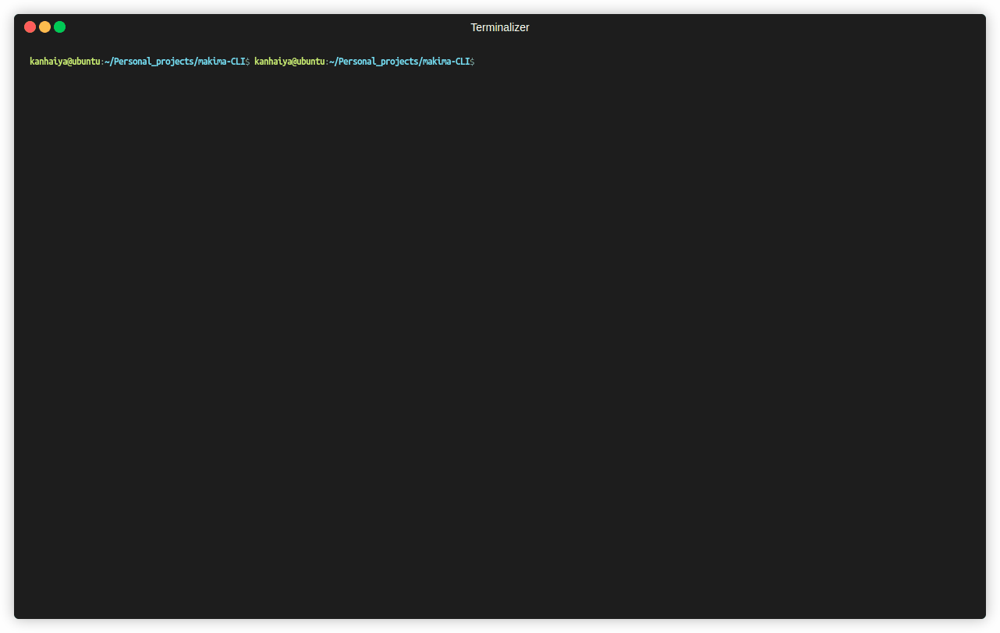

# Makima CLI 🤖

An AI-powered coding assistant that runs in your terminal. Point it at any codebase and ask questions, make edits, and run commands — all from a clean CLI interface.

## Features

- Understands your entire codebase
- Answers questions about your code
- Edits files with auto git backup before changes
- Creates new files
- Runs terminal commands with confirmation
- Works on any project
- Clean terminal UI with syntax highlighting

## Install

git clone https://github.com/kanhaiya-ML/makima-cli.git
cd makima-cli
pip install -r requirements.txt

## Setup

Create a .env file in the project root:
GROQ_API_KEY=your_key_here

Get a free API key at https://console.groq.com

## Usage

Point it at any project:
python main.py /path/to/your/project

Or run from inside a project folder:
cd your-project
python /path/to/makima-cli/main.py

## Built With

- Python
- Groq API
- Rich
- GitPython